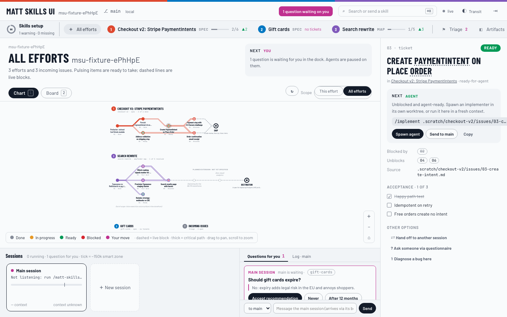
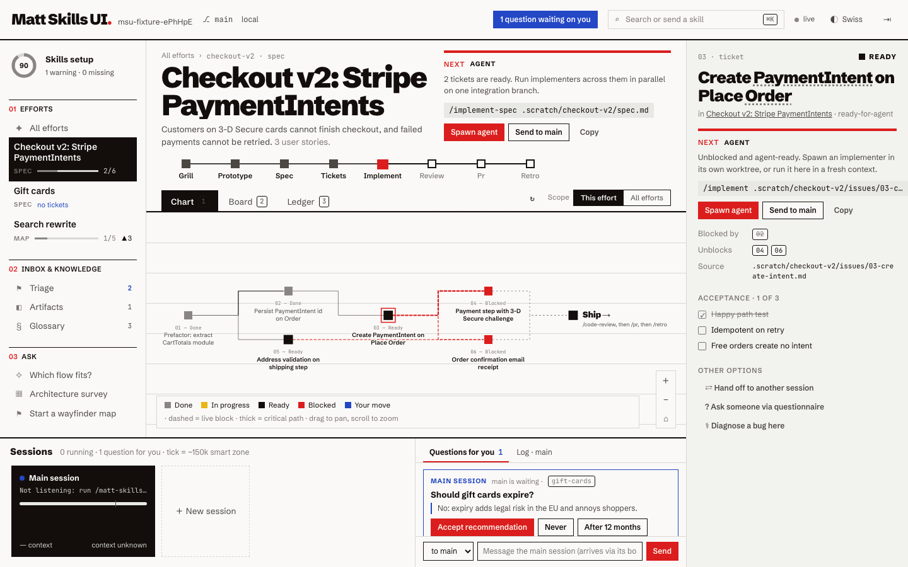
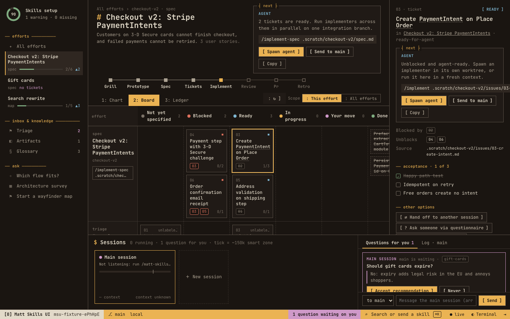
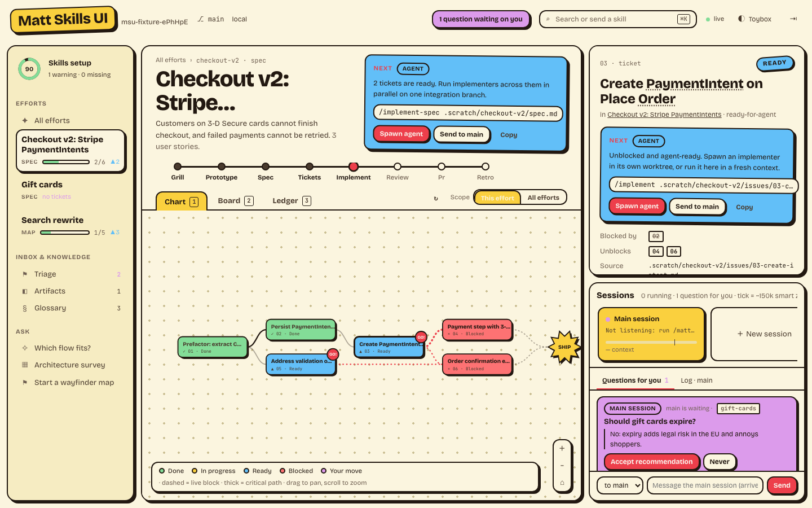

# Matt Skills UI

**A live web board for [mattpocock/skills](https://github.com/mattpocock/skills), as a Claude Code plugin.**
Type `/matt-skills-ui` and your browser opens on everything those skills have written in your repo: specs, tickets and wayfinder maps drawn as a dependency graph, what's blocked and what's ready, and the exact next command for each item. From the same page you can spawn background agents and answer their questions.

[](LICENSE)


> **Unofficial.** This is a community project. It is not made, endorsed or maintained by Matt Pocock or AI Hero. It only reads the files and issues his skills produce.



---

## Contents

- [Why](#why)
- [Features](#features)
- [Themes](#themes)
- [Requirements](#requirements)
- [Setup](#setup)
- [Using the board](#using-the-board)
- [Commands](#commands)
- [How it reads your repo](#how-it-reads-your-repo)
- [Configuration and data](#configuration-and-data)
- [Security](#security)
- [Troubleshooting](#troubleshooting)
- [FAQ](#faq)
- [Development](#development)
- [License](#license)

## Why

Matt Pocock's skills (`/to-spec`, `/to-tickets`, `/wayfinder`, `/triage`, `/implement-spec`…) keep their state in plain files and issues: a `spec.md`, one file per ticket with a `Blocked by:` line, a wayfinder `map.md` with its decisions and fog. That's great for agents. It's harder for a human to see at a glance which ticket is unblocked, which decision is waiting on you, or what to run next.

Matt Skills UI turns that state into a board, and the board stays in sync because it re-reads the same files and issues the skills write.

## Features

- **Dependency graph** of every spec and wayfinder map. Ready tickets pulse, live blocks are dashed, and the critical path is drawn thicker. Pan and zoom, or switch to **All efforts** to see every spec and map at once.
- **Swimlane board**: one lane per effort, with columns *Not yet specified → Blocked → Ready → In progress → Your move → Done*. Hover a ticket to draw lines to what blocks it and what it unblocks.
- **Ledger**: a table of the same tickets, which also flags blocked-by cycles.
- **Next command for everything**, worked out from the skills' own flow (`/to-tickets`, `/implement`, `/implement-spec`, `/wayfinder`, `/to-spec`, `/triage`, `/code-review`…). Every suggestion has **Send to main**, **Spawn agent** and **Copy** buttons.
- **Spawn background agents** (headless `claude -p`), each optionally in its own git worktree. Their logs stream live into the dock, and you can reply to them.
- **Questions for you**: when an agent asks for a decision, it appears with its recommended answer, and one click accepts it. Questions from your main session appear here too.
- **Message your main session** from the browser. Your text arrives in the Claude Code session that opened the board, as if you typed it.
- **Context gauges** for every session, marked at the ~150k "smart zone".
- **Skills setup health**: what `/setup-matt-pocock-skills` wrote, what's missing or out of date, and which of Matt's skills are installed.
- **Triage inbox** bucketed the way `/triage` does it, with automatic matching against `.out-of-scope/`.
- **Artifacts** (prototype and research branches, architecture reports, handoffs, questionnaires, ADRs) and the **Glossary**. Glossary terms are underlined everywhere they appear; hover one for its definition.
- **Live**: file changes show up in about a second, and GitHub/GitLab is polled every minute.
- **`⌘K` palette** for any ticket, effort or skill.

## Themes

You pick a theme when you install the plugin and can change it at any time. Every theme has the same features. Each one also changes the layout and how the graph is drawn, not just the colours.

| Swiss | Terminal |
|---|---|
|  |  |
| Strict grid, one red accent, square nodes and right-angled lines. | Warm terminal look with tmux-style panes and a status bar; boxes with a blinking cursor on ready tickets. |
| **Transit** | **Toybox** |
|  |  |
| Each effort is a metro line and tickets are stations. Unspecified work is drawn as a planned extension. | Neo-brutalist: chunky borders, hard shadows, bright cards and "GO!" stickers. |

## Requirements

| What | Why |
|---|---|
| [Claude Code](https://code.claude.com) 2.1.271 or newer | Plugin options with a fixed choice list (the theme picker) need 2.1.271+. Tested on 2.1.290. |
| Node.js 20+ | Runs the board server. Nothing to `npm install`. |
| [mattpocock/skills](https://github.com/mattpocock/skills) | The board shows what these skills write. |
| `gh`, logged in | Only if your issue tracker is GitHub. |
| `glab`, logged in | Only if your issue tracker is GitLab. |
| `git` | For branch info and for agent worktrees. |

macOS and Linux are tested. Windows should work, but nobody has tried it yet.

## Setup

### 1. Install mattpocock/skills

If you don't have them yet, pick one of these.

As a Claude Code plugin:

```bash
claude plugin install mattpocock-skills
```

Or as editable files with skills.sh:

```bash
npx skills@latest add mattpocock/skills
```

### 2. Configure your repo for the skills

In Claude Code, inside your project, run this once:

```
/setup-matt-pocock-skills
```

It records where your issues live (GitHub, GitLab or local `.scratch/` files), your triage labels and your domain-doc layout. The board reads the same files. If you skip this step, the board guesses from your `git` remote and shows a setup warning.

### 3. Install Matt Skills UI

From your terminal:

```bash
claude plugin marketplace add hsyam/matt-skills-ui
claude plugin install matt-skills-ui@matt-skills-ui
```

Or from inside a Claude Code session:

```
/plugin marketplace add hsyam/matt-skills-ui
/plugin install matt-skills-ui@matt-skills-ui
```

When the plugin is enabled, Claude Code asks for its one option, **Board theme**: `swiss`, `terminal`, `transit` or `toybox`. If you're not sure, keep the default (`swiss`); you can switch from the board later.

### 4. Open the board

In Claude Code, inside your project:

```
/matt-skills-ui
```

The command will:

1. start a small local server for this repo, or reuse one that's already running,
2. open the board in your browser and print its URL, which includes a private access token, so you can reopen it later,
3. start a listener in this session, so messages and answers you send from the board arrive here.

That's it. Keep the session open while you use the board; it's the "main session" the board talks to.

### Try it without installing

Clone the repo and load it for one session:

```bash
git clone https://github.com/hsyam/matt-skills-ui
cd your-project
claude --plugin-dir ../matt-skills-ui
```

Then run `/matt-skills-ui` as usual.

## Using the board

### The layout

| Area | What's there |
|---|---|
| **Left sidebar** | Setup health, your efforts (specs and maps, with progress and how many tickets are ready), then Triage, Artifacts and Glossary, plus shortcuts to `/ask-matt`, `/improve-codebase-architecture` and `/wayfinder`. |
| **Centre** | The selected effort's header with its **Next** command and where it sits in the flow (grill → prototype → spec → tickets → implement → review → PR → retro), then the **Chart**, **Board** or **Ledger** view. |
| **Right panel** | The selected ticket: its state, next command, what blocks it, what it unblocks, its source file or issue, and acceptance criteria. Press `]` to hide it. |
| **Dock** (bottom; in Toybox it's on the right) | Your sessions with their context gauges, **Questions for you**, each session's log, and a message box. |

### What "Next" means

The board recommends the step the skills' own flow calls for:

| You see | The board suggests |
|---|---|
| A spec with no tickets | `/to-tickets <spec>` |
| One ticket ready | `/implement <ticket>`, or spawn an implementer |
| Several tickets ready | `/implement-spec <spec>`, to run them in parallel on one branch |
| Every ticket done | `/code-review main`, then `/pr`, then `/retro` |
| A wayfinder research ticket | Spawn a background research agent; it needs no human |
| A grilling, prototype or task ticket | `/wayfinder <map> <ticket>`; it needs you |
| A map with nothing left open and no fog | `/to-spec <map>` |
| An untriaged issue | `/triage <issue>`, flagged when it matches `.out-of-scope/` |

### Send to main, Spawn agent, or Copy

- **Send to main** delivers the command to the Claude Code session that opened the board, as if you typed it there.
- **Spawn agent** starts a separate background session. A dialog lets you edit the prompt and choose:
  - **Permission mode.** Background agents can't stop to ask you for permission, so anything your settings don't already allow is denied. Pick accordingly:

    | Mode | Use for |
    |---|---|
    | `acceptEdits` (default) | Implementers that need to edit files |
    | `auto` | Letting Claude decide what's safe |
    | `plan` | Read-only research and exploration |
    | `default` | Only what your settings already allow |

  - **Own git worktree** (on by default for `/implement`), so parallel agents don't trip over each other. Each worktree gets its own branch, `msu/<agent>`.
- **Copy** puts the command on your clipboard.

### Answering questions

When a spawned agent needs a decision, it ends its turn with a question, its recommendation and optional choices. The question shows in **Questions for you**, with a badge in the header. You can:

- click **Accept recommendation**,
- pick one of the offered options, or
- click **Reply…** and type your own answer.

The agent continues as soon as you answer. Your main session posts its questions the same way, and your answer reaches it through the board listener.

### Keyboard

| Key | Action |
|---|---|
| `1` `2` `3` | Chart, Board, Ledger |
| `⌘K` / `Ctrl+K` | Search tickets and efforts, or send a skill |
| `]` | Show or hide the ticket panel |
| `Alt+←` / `Alt+→` | Previous or next theme |
| `Esc` | Close dialogs |

## Commands

| Command | What it does |
|---|---|
| `/matt-skills-ui` | Start or reuse the board for this repo, open it, and listen for board messages |
| `/matt-skills-ui status` | Show whether it's running, plus counts of efforts, issues, sessions and questions |
| `/matt-skills-ui stop` | Stop the board, along with any agents it spawned |
| `/matt-skills-ui theme <name>` | Switch to `swiss`, `terminal`, `transit` or `toybox` |
| `/matt-skills-ui theme default` | Go back to the theme you chose at install |

You can change the theme in three places:

- the **◐ Theme** button on the board, which previews all four,
- the `theme` command above,
- `/config` → plugin options, which changes the install default.

When they disagree, the most recent choice on the board or command wins over the install default.

## How it reads your repo

The tracker comes from `docs/agents/issue-tracker.md`, which `/setup-matt-pocock-skills` writes.

| Tracker | What the board reads |
|---|---|
| **Local markdown** | `.scratch/<feature>/spec.md` or `map.md`, plus `.scratch/<feature>/issues/NN-slug.md` with `Blocked by:`, `Status:`, `Type:` and `- [ ]` acceptance criteria. A folder with issues but no spec or map is treated as incoming triage work. |
| **GitHub** | Issues via `gh`, using GitHub's native sub-issues and "blocked by" links when available, and the skills' `## Parent`, `## Blocked by` and `Part of #N` conventions otherwise. Maps are issues labelled `wayfinder:map`; ticket types come from `wayfinder:*` labels; triage states come from your mapping in `docs/agents/triage-labels.md`. |
| **GitLab** | Issues via `glab`, with edges read from issue bodies. Native blocking links aren't read yet. |

The board also reads:

- `CLAUDE.md` or `AGENTS.md` (the `## Agent skills` block),
- `GLOSSARY.md`, or `GLOSSARY-MAP.md` for multi-context repos,
- `docs/adr/` and `.out-of-scope/`,
- `prototype/*` and `research/*` branches,
- `to-questionnaire-*.md`, and architecture reports and handoffs in your temp folder.

It never writes to your repo. The only exception is git worktrees for agents you spawn, and those live outside the repo.

## Configuration and data

| Setting | Where |
|---|---|
| Install-time theme | `pluginConfigs` in `~/.claude/settings.json`, written by Claude Code |
| Theme override, sessions, outbox, logs | `~/.matt-skills-ui/`, with one folder per repo under `repos/<hash>/` |
| Agent worktrees | `~/.matt-skills-ui/repos/<hash>/worktrees/<agent>` |

Environment variables:

- `MATT_SKILLS_UI_HOME` moves the data folder (handy for testing).
- `MATT_SKILLS_UI_CLAUDE` points at a different `claude` binary for spawned agents.

## Security

- The server listens on `127.0.0.1` only, so nothing outside your machine can reach it.
- Each run creates a random access token. Every API call must carry it, and requests from other origins are refused, so other web pages open in your browser can't drive your sessions.
- Spawned agents run with the permission mode you choose in the spawn dialog and can't escalate it.
- Messages you send from the board reach your main session exactly as typed. Treat the board URL like a password while it's running.

## Troubleshooting

<details>
<summary><b>The board says the main session isn't listening</b></summary>

The listener in your Claude Code session stopped: the session ended, or the listener ran out of time and wasn't restarted. Run `/matt-skills-ui` again in the session you want connected. It reuses the running board and restarts the listener.
</details>

<details>
<summary><b>"gh repo view failed" or "gh api failed" banner</b></summary>

Run `gh auth status` in the repo. The board uses your `gh` login and only reads; it never edits issues.
</details>

<details>
<summary><b>A spawned agent stops with permission errors</b></summary>

Background agents can't ask for permission. Spawn again with `acceptEdits` or `auto`, or allow the commands it needs in your Claude Code settings.
</details>

<details>
<summary><b>The board doesn't open, or shows "Can't reach the board server"</b></summary>

Run `/matt-skills-ui status`. If it isn't running, start it again. The server log is at `~/.matt-skills-ui/repos/<hash>/server.log`.
</details>

<details>
<summary><b>My tickets don't show up</b></summary>

Check **Skills setup** on the board. Local tickets need to be in `.scratch/<feature>/issues/NN-*.md` next to a `spec.md` or `map.md`. GitHub tickets need a parent (as a sub-issue, or `## Parent #N` in the body) or the `wayfinder:map` label on the map issue.
</details>

<details>
<summary><b>Cleaning up agent worktrees</b></summary>

Worktrees are kept so you can review and merge each agent's branch. List and remove them with git:

```bash
git worktree list
git worktree remove <path>
git branch -D msu/<agent>
```
</details>

## FAQ

**Does it change my repo or my issues?**
No. It only reads. Changes happen only when you send or spawn commands, and then Claude does the work, under the permission mode you chose.

**What does it cost?**
The board itself is free. Spawned agents are normal Claude Code sessions billed to your account, and the dock shows each one's cost.

**Can I keep working in the terminal?**
Yes. The board and the terminal see the same files. Answers typed in either place count.

**Does it work with Codex or other agents?**
The board reads the same files no matter which agent wrote them. Spawning agents and messaging the main session currently need Claude Code.

**Does it work offline?**
Yes, apart from the web fonts, which load from Google Fonts and fall back to system fonts when offline.

## Development

No build step and no dependencies. Project layout:

```
.claude-plugin/          plugin.json (manifest, theme option) and marketplace.json
skills/matt-skills-ui/   the /matt-skills-ui command
server/                  cli.mjs, server.mjs, and lib/ (local, GitHub and GitLab readers, setup scan, sessions)
web/                     index.html, app.js (UI), engine.mjs (next-move logic, shared with tests), style.css (all four themes)
test/                    unit tests and fixtures/acme-local (a repo in the skills' exact formats)
.claude/skills/run-matt-skills-ui/   driver for agents: smoke tests, screenshots, real spawn test
docs/                    screenshots and design history
```

Common commands:

```bash
npm test                                                     # unit tests
node .claude/skills/run-matt-skills-ui/driver.mjs smoke      # real server against the fixture: 13 end-to-end checks
node .claude/skills/run-matt-skills-ui/driver.mjs smoke --shots   # plus a screenshot per theme
node .claude/skills/run-matt-skills-ui/driver.mjs spawn      # plus a real headless agent (Haiku, about $0.10)
npm run validate                                             # claude plugin validate
claude --plugin-dir .                                        # try the command in a session
```

Issues and pull requests are welcome. Please run `npm test` and the smoke driver before opening a PR.

## License

[MIT](LICENSE) © Hassan Syam.

The skills, and the ideas behind specs, tickets, wayfinder maps and triage, belong to [Matt Pocock's skills](https://github.com/mattpocock/skills). Go star that repo.
